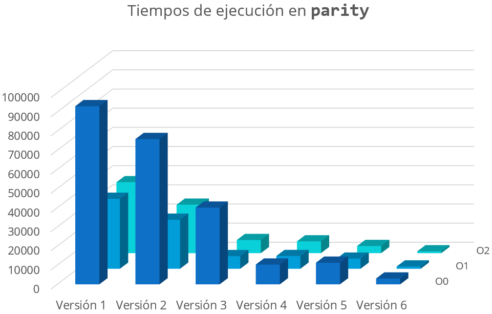
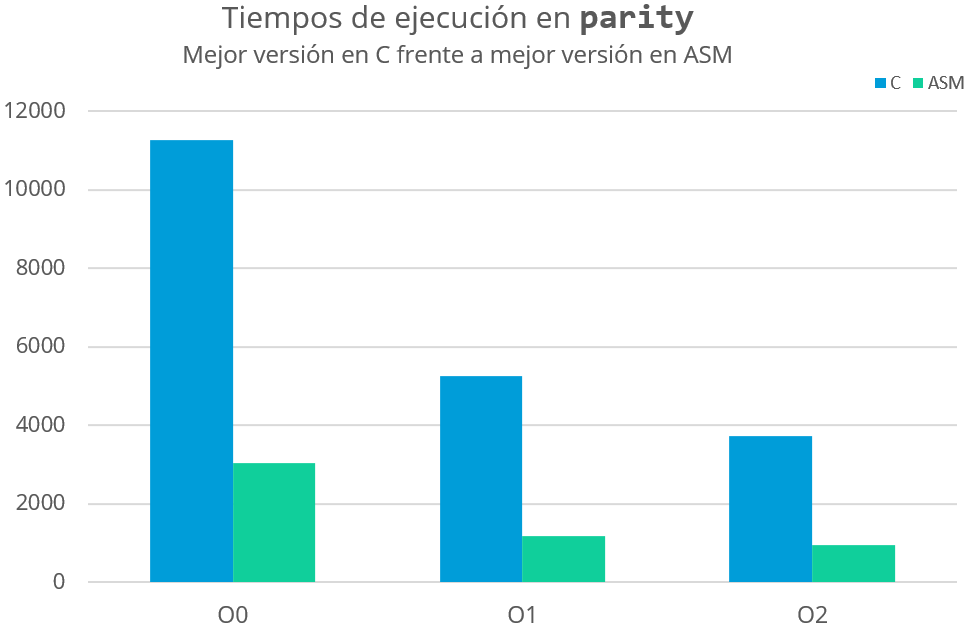

**`ED`  >  Prácticas  >  Práctica 2**

# :two: Programación mixta C-asm x86 Linux

> Alumno: Miguel Ángel Fernández Gutiérrez \<<mianfg@correo.ugr.es>\>
>
> Fecha: 2 de diciembre, 2018
>
> Curso: 2º Doble Grado en Ingeniería Informática y Matemáticas, 2018/19

[TOC]

### 2.1. Calcular la suma de bits de una lista de enteros sin signo

> El código completo se encuentra en `popcount.c`

#### Versiones

A continuación figuran las versiones del código, implementadas como funciones dentro de `popcount.c`.

##### Versión 1: usando un `for`

Esta versión utiliza un `for` para calcular el _peso Hamming_ de cada elemento.

~~~c
int popcount_v1(unsigned *array, int longitud) {
    int i, j, resultado = 0;
    for ( i=0; i<longitud; i++ )
        for ( j=0; j<WSIZE; j++ ) {   // WSIZE es 8*sizeof(int)
            unsigned mask = 0x1 << j;
            resultado += (array[i] & mask) != 0;
        }
    return resultado;
}
~~~


##### Versión 2: usando un `while`

Esta versión utiliza un `while` para calcular el _peso Hamming_ de cada elemento.

~~~c
int popcount_v2(unsigned *array, int longitud) {
    int i, j, resultado = 0;
    for ( i=0; i<longitud; i++ ) {
        unsigned x = array[i];
        do {
            resultado += x & 0x1;
            x >>= 1;
        } while (x);
    }
    return resultado;
}
~~~


##### Versión 3: usando `asm`

A continuación, usamos código ensamblador en C gracias a `asm`.

~~~c
int popcount_v3(unsigned *array, int longitud) {
    int i, resultado = 0;
    for ( i=0; i<longitud; i++ ) {
        unsigned x = array[i];
        asm("\n"
           ".ini3:			\n\t"
           "shr %[x]		\n\t"
           "add $0, %[r]	\n\t"
           "cmp $0, %[x]	\n\t"
           "jne .ini3		\n\t"
           
           : [r] "+r" (resultado)
           : [x] "r" (x));
    }
    return resultado;
}
~~~


##### Versión 4: máscara diferente y variable auxiliar

En esta versión, calcularemos el _peso Hamming_ mediante comparaciones con otra máscara, diferente a las anteriores, y sumando a una variable auxiliar, que llamaremos `aux`, el resultado de dichas comparaciones.

~~~c
int popcount_v4(unsigned *array, int longitud) {
    int i, j, resultado = 0;
    for ( i=0; i<longitud; i++ ) {
        int aux = 0;
        unsigned x = array[i];
        for ( j=0; j<8; j++ ) {
            aux += x & 0x01010101;
            x >>= 1;
        }
        
        aux += (aux>>16);
        aux += (aux>>8);
        resultado += (aux&0xff);
    }
    return resultado;
}
~~~


##### Versión 5: SSE

~~~c
int popcount_v5(unsigned *array, int longitud) {
    int i, aux, resultado=0;
    int SSE_mask[] = { 0x0f0f0f0f, 0x0f0f0f0f, 0x0f0f0f0f, 0x0f0f0f0f };
	int SSE_LUTb[] = { 0x02010100, 0x03020201, 0x03020201, 0x04030302 };
    
    if ( longitud & 0x3 )
        printf("Leyendo 128 bits, pero longitud no múltiplo de 4\n");
    
    for ( i=0; i<longitud; i+=4 ) {
        asm(
        	"movdqu %[x], %%xmm0	\n\t"
			"movdqu %[m], %%xmm6	\n\t"
			"movdqa %%xmm0, %%xmm1	\n\t"
			"psrlw $4, %%xmm1		\n\t"
			"pand %%xmm6, %%xmm0	\n\t"
			"pand %%xmm6, %%xmm1	\n\t"
			"movdqu %[l], %%xmm2	\n\t"
			"movdqa %%xmm2, %%xmm3	\n\t"
			"pshufb %%xmm0, %%xmm2	\n\t"
			"pshufb %%xmm1, %%xmm3	\n\t"
			"paddb %%xmm2, %%xmm3	\n\t"
			"pxor %%xmm0, %%xmm0	\n\t"
			"psadbw %%xmm0, %%xmm3	\n\t"
			"movhlps %%xmm3, %%xmm0	\n\t"
			"paddd %%xmm3, %%xmm0	\n\t"
			"movd %%xmm0, %[aux]	\n\t"

			: [aux] "=r" (aux)
			: [x] "m" (array[i]),
			[m] "m" (SSE_mask[0]),
			[l] "m" (SSE_LUTb[0])
        );
        resultado += aux;
    }
    return resultado;
}
~~~


##### Versión 6: usando llamada `popcnt`

En esta versión utilizamos la llamada ASM `popcnt`.

~~~c
int popcount_v6(unsigned *array, int longitud) {
    int i, aux, resultado = 0;
    unsigned x;
    for ( i=0; i<longitud; i++ ) {
        x = array[i];
        asm(
            "popcnt %[x], %[aux]"
            
            : [aux] "=r" (aux)
            : [x] "r" (x)
        );
        resultado += aux;
    }
    return resultado;
}
~~~


#### Medición de tiempos

A continuación, hacemos uso de la siguiente función:

~~~c
void crono(int (*func)(), char* msg){
    struct timeval tv1,tv2;	// gettimeofday() secs-usecs
    long           tv_usecs;	// y sus cuentas

    gettimeofday(&tv1,NULL);
    total = func(lista, SIZE);
    gettimeofday(&tv2,NULL);

    tv_usecs=(tv2.tv_sec -tv1.tv_sec )*1E6+
             (tv2.tv_usec-tv1.tv_usec);
    printf("resultado = %d\t", total);
    printf("%s:%9ld us\n", msg, tv_usecs);
}
~~~

Junto con el siguiente `main`:

~~~c
int main() {
	unsigned i;
	for(i=0; i<SIZE; i++)
        lista[i]=i;
    
    crono(popcount_v1, "popcount (v1)");
    crono(popcount_v2, "popcount (v2)");
    crono(popcount_v3, "popcount (v3)");
    crono(popcount_v4, "popcount (v4)");
    crono(popcount_v5, "popcount (v5)");
    crono(popcount_v6, "popcount (v6)");
    printf("nºbits*tamaño/2 = %d\n", (1<<20)*20/2);

    exit(0);
}
~~~


Y compilaremos con los tres niveles de optimización:

~~~
gcc -m32 -g -O0 popcount.c -o popcount_O0
gcc -m32 -g -O1 popcount.c -o popcount_O1
gcc -m32 -g -O2 popcount.c -o popcount_O2
~~~


Realizaremos once ejecuciones (ignorando la primera) por compilación de `popcount_Ox`, obteniendo los siguientes resultados:


> Los datos completos están en el documento `tiempos.ods`


### 2.2. Calcular la suma de paridades de una lista de enteros sin signo

> El código completo se encuentra en `parity.c`

#### Versiones

##### Versión 1: usando un `for`

~~~C
int parity_v1(unsigned *array, int longitud) {
    int i, j, resultado = 0, aux = 0;
    for ( i=0; i<longitud; i++ ) {
        for ( j=0; j<WSIZE; j++ ) {
            unsigned mask = 0x1<<j;
            aux ^= (array[i]&mask)!=0;
        }
        resultado += aux;
    }
    return resultado;
}
~~~


##### Versión 2: usando un `while`

~~~c
int parity_v2(unsigned *array, int longitud) {
    int i, j, resultado = 0, aux = 0;
    for ( i=0; i<longitud; i++ ) {
        j = 0;
        while ( j < WSIZE ) {
            unsigned mask = 0x1<<j;
            aux ^= (array[i]&mask)!=0;
        }
        resultado += aux;
    }
    return resultado;
}
~~~


##### Versión 3: comparando bit a bit

~~~c
int parity_v3(unsigned *array, int longitud) {
    int i;
    unsigned resultado = 0, aux = 0, mask = 0x1, x;
    for ( i=0; i<longitud; i++ ) {
        x = array[i];
        while (x) {
            val ^= x;
            x >> 1;
        }
        resultado += (aux&mask);
        aux = 0;
    }
    return resultado;
}
~~~


##### Versión 4: usando `asm`

~~~c
int parity_v4(unsigned *array, int longitud) {
    int i;
    unsigned resultado = 0, aux = 0, mask = 0x1, x;
    for ( i=0; i<longitud; i++ ) {
        x = array[i];
        aux = 0;
        asm( "\n"
            ".ini3:				\n\t"
            	"xor %[x], %[a]	\n\t"
            	"shr %[x]		\n\t"
            	"jnz .ini3		\n\t"
            	"and $0x1, %[a]	\n\t"
            	
            : [a] "+r" (aux)
            : [x] "r" (x)
        );
        resultado += aux;
    }
    return resultado;
}
~~~


##### Versión 5: comparando `x` consigo misma desplazada

~~~c
int parity_v5(unsigned *array, int longitud) {
    int i, j;
    unsigned resultado = 0, mask = 0x1, x;
    for ( i=0; i<longitud; i++ ) {
        x = array[i];
        for ( j=16; j>=1; j/=2 )
            x ^= (x>>j);
        resultado += (x&mask);
    }
    return resultado;
}
~~~


##### Versión 6: versión anterior usando `asm`

~~~c
int parity_v6(unsigned *array, int longitud) {
    int i, j;
    unsigned resultado = 0, x;
    for ( i=0; i<longitud; i++ ) {
        x = array[i];
        asm( "\n"
            "mov %[x], %%edx	\n\t"
            "shr $0x10, %[x]	\n\t"
            "xor %[x], %%edx	\n\t"
            "shr $0x08, %[x]	\n\t"
            "xor %[x], %%edx	\n\t"
            "setpo %%dl			\n\t"
            "movzx %%dl, %[x]	\n\t"
            
            : [x] "+r" (x)
            :
            : "edx"
        );
        resultado += x;
    }
    return resultado;
}
~~~


#### Medición de tiempos

A continuación, hacemos uso de la siguiente función:

```c
void crono(int (*func)(), char* msg){
    struct timeval tv1,tv2;	// gettimeofday() secs-usecs
    long           tv_usecs;	// y sus cuentas

    gettimeofday(&tv1,NULL);
    total = func(lista, SIZE);
    gettimeofday(&tv2,NULL);

    tv_usecs=(tv2.tv_sec -tv1.tv_sec )*1E6+
             (tv2.tv_usec-tv1.tv_usec);
    printf("resultado = %d\t", total);
    printf("%s:%9ld us\n", msg, tv_usecs);
}
```

Junto con el siguiente `main`:

```c
int main() {
	unsigned i;
	for(i=0; i<SIZE; i++)
        lista[i]=i;
    
    crono(parity_v1, "parity (v1)");
    crono(parity_v2, "parity (v2)");
    crono(parity_v3, "parity (v3)");
    crono(parity_v4, "parity (v4)");
    crono(parity_v5, "parity (v5)");
    crono(parity_v6, "parity (v6)");
    printf("nºbits*tamaño/2 = %d\n", (1<<20)*20/2);

    exit(0);
}
```


Y compilaremos con los tres niveles de optimización:

```
gcc -m32 -g -O0 parity.c -o parity_O0
gcc -m32 -g -O1 parity.c -o parity_O1
gcc -m32 -g -O2 parity.c -o parity_O2
```


Realizaremos once ejecuciones (ignorando la primera) por compilación de `parity_Ox`, obteniendo los siguientes resultados:








> Los datos completos están en el documento `tiempos.ods`


### Preguntas de autocomprobación

#### `popcount`

2. **Diseñar la fórmula sugerida en el cuarto párrafo. ¿Cómo se ha razonado ese cálculo?**

   El cálculo procede del siguiente modo: se multiplica el número de elementos de la lista (2^20) por el número de bits de cada una (20), y luego se divide entre dos. De aquí podemos inferir que en una lista de 2^20 términos de unos 20 bits cada uno, tenemos en total 2^20*20 bits, y al estar numerados desde el 0 (`0000...0`) hasta el 2^20-1 (`1111...1`), una de las mitades es 0 y la otra mitad es 1 (por ello dividiremos entre 2).

7. **La versión 3 probablemente producirá resultados extraños, porque no sea mejor que la anterior (versión 2, incluso usando restricciones a registros) y/o o porque tarde lo mismo independientemente del nivel de optimización. Intentar buscar explicación a ambas características, comparando los códigos ASM generados.**

   En efecto, basta ver los resultados (adjuntados en el archivo `tiempos.ods`) para ver que esto es lo que ocurre. Esto se debe, sin embargo, a que C utiliza únicamente expresiones aritméticas, mientras que ASM usa además de esto instrucciones que necesitan consultar flags de estado, como `adc`.

8. **Realizar dos gráficas Calc o Excel del tipo “columnas 3D”, una mostrando todos los resultados y otra mostrando la mejor versión C y las versiones ASM que le superan. ¿Qué ha tenido más impacto, mejorar la programación C o usar ASM?**

   Claramente podemos ver que mejora el uso de ASM.

   > Las gráficas se encuentran en el apartado _Medición de tiempos_.


#### `parity`

1. **Diseñar la fórmula sugerida en el cuarto párrafo de la sección 4.2. ¿Cómo se ha razonado ese cálculo?**

   Es el número de elementos de la lista (2^20 elementos) entre 2. Esto es así ya que en una lista de 2^20 términos enumerados desde el 0 (`0000...0`) hasta el 2^20-1 (`1111...1`), la mitad de ellos son pares, y la otra impares.

9. **Realizar dos gráficas Calc o Excel del tipo “columnas 3D”, una mostrando todos los resultados y otra mostrando la mejor versión C y las versiones ASM que le superan. ¿Qué ha tenido más impacto, mejorar la programación C o usar ASM?**

   Evidentemente, es mejor usar ASM.

   > Las gráficas se encuentran en el apartado _Medición de tiempos_.