**`ED`  >  Teoría  >  Tema 3**

# :three: Unidad central de procesamiento (CPU)

## 1. Introducción

###### Esquema general de un ordenador sencillo (arquitectura Von Newmann)

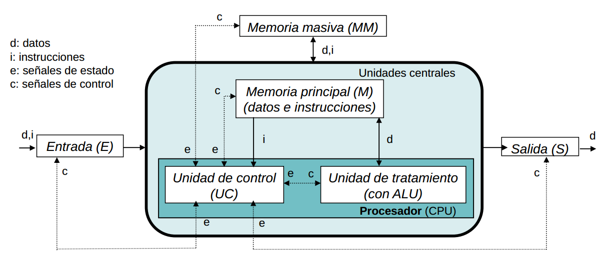

Nos centraremos en el procesador: UC y ALU.

#### ALU

**ALU: _arithmetic logic unit_, unidad de tratamiento, unidad de procesamiento, camino de datos o unidad aritmético-lógica:**

* Contiene los circuitos electrónicos con las que se realizan operaciones aritmético-lógicas.
* Los elementos auxiliares (**registros**) donde se almacenan temporalmente los datos con los que se opera.

#### UC

**UC: unidad de control**

* Detecta señales de estado (eléctricas) procedentes de las unidades.

* Capta de memoria una a una las instrucciones máquina del programa.

* Genera señales de control a todas las unidades, monitorizando operaciones que implican ejecución de instrucción.

* Contiene un **reloj** que sincroniza todas las operaciones elementales de la computadora.

  * **Tiempo de ciclo:** período de reloj (entre décimas de ns y varios μs).
  * **Frecuencia de reloj:** determina la velocidad de funcionamiento del computador (MHz ó GHz).

* Interpreta y controla la ejecución de instrucciones leídas de memoria en dos fases:

  * **Fase de captación de instrucción:** lee la dirección de instrucción a ejecutar, la lee de memoria, la lleva al registro adecuado para su ejecución e incrementa el PC para que apunte a la siguiente instrucción.

    ~~~
    AR <- PC
    DR <- M(AR)
    IR <- DR
    PC <- PC+1
    ~~~

  * **Fase de ejecución:** la instrucción se decodifica y ejecuta bajo el control de la UC, para ello:

    1. se realizan las operaciones específicas correspondientes al código de operación (_codop_) de la instrucción captada.

    2. se generan las señales de control oportunas.

Existen dos **formas de diseñar la UC**:

* **Control cableado:**
  * Se usan métodos de diseño de circuitos digitales secuenciales a partir de diagramas de estado.
  * El circuito final se obtiene conectando componentes básicos (biestables, puertas...) y muy a menudo PLA.
* **Control microprogramado:**
  * Las señales de control se almacenan en una memoria ROM (de control).
  * Las microórdenes implementan las distintas instrucciones.
  * Método estándaren CISC.

## 2. Unidad de tratamiento

> El conjunto de elementos de un procesador no dedicados a control suele denominarse **unidad aritmético-lógica** o **unidad de tratamiento** o **camino de datos**.

Usualmente el término _ALU_ se reserva sólo para los circuitos específicos que realizan este tipo de operaciones.

La **unidad de tratamiento** o **camino de datos**, por tanto, contiene a la ALU, un banco de registros, los biestables indicadores, multiplexores, etc.

* Usualmente en la ALU se realizan **operaciones muy sencillas**, con los datos del banco de registros, como desplazamientos, rotaciones, comparaciones, sumas, restas, multiplicaciones y divisiones.
* En los microprocesadores actuales se suele incluir en el procesador una **unidad de coma flotante** (FPU) que realiza operaciones aritméticas más complejas. Antes, esta unidad se incluía en un chip aparte (_coprocesador aritmético_).

Para etender el diseño y funcionamiento de una unidad de tratamiento, veremos el diseño a nivel micromáquina de un **ordenador didáctico elemental**: `CODE-2`.

A nivel de micromáquina se usan los elementos del nivel inmediatamente inferior, es decir, el nivel de lógica digital. Por tanto, partimos de los siguientes elementos:

| Elemento                                       | Esquema                          | Descripción                                                  |
| ---------------------------------------------- | -------------------------------- | ------------------------------------------------------------ |
| Decodificador binario                          | 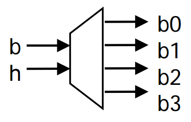   | Todas las salidas son 0, menos la que corresponde al valor decimal de entrada. _Ej.:_ `bh==00 -> b0=1` |
| Multiplexor o selector                         | 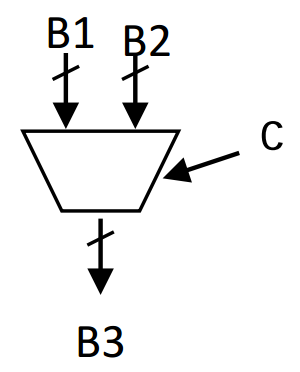   | En el bus de salida (`B3`) aparece la información de sólo uno de los buses de entrada. _En el caso de buses de 16bits:_ `c=0 -> B3(15:0)=B1(15:0); c=1 -> B3(15:0)=B2(15:0)` |
| Adaptador tri-estado                           | 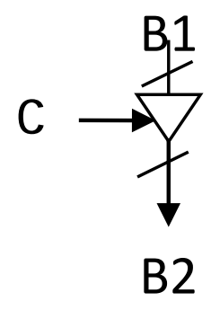   | Si `c=0`, la salida está en estado de _alta impedancia_, pudiendo estar el bus `B2` eléctricamente conectado a la salida de otro circuito. Si `c=1`, la información de `B1` aparece en `B2`. |
| ALU                                            | 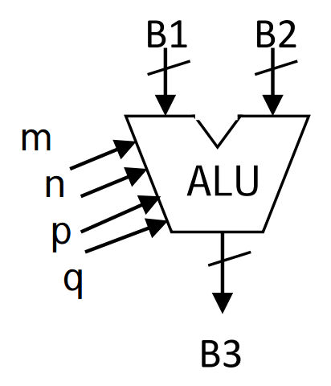   | En `B3` se obtiene el resultado de efectuar la operación (concretada con las señales de control `m`, `n`, `p`, `q`) entre los datos de los buses `B1` y `B2`. |
| Registro                                       | 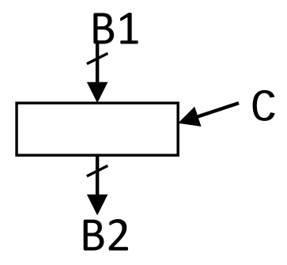   | `c=1`: la información del bus de entrada (`B1`) se graba en el registro, apareciendo siempre en el bus de salida (`B2`) la información almacenada. |
| Biestable asíncrono                            | 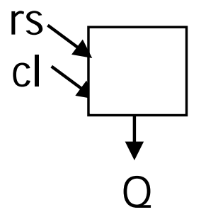   | `rs=1`: queda almacenado en el biestable un 1. `cl=1`: queda almacenado en el biestable un 0. |
| Banco de registros _(16 registros de 16 bits)_ | 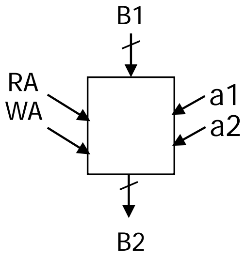   | `RA` se compone de 4 hilos, que seleccionan el registro a leer; `WA` se compone de 4 hilos, que seleccionan el registro a grabar. `a1=1`: aparece en el bus de salida (`B2`) la información del registro seleccionado con `RA`. `a2=1`: se escribe en el registro eleccionado por `WA` la información que exista en el bus de entrada (`B1`). Es posible leer y escribir de forma simultánea. |
| Reloj                                          | 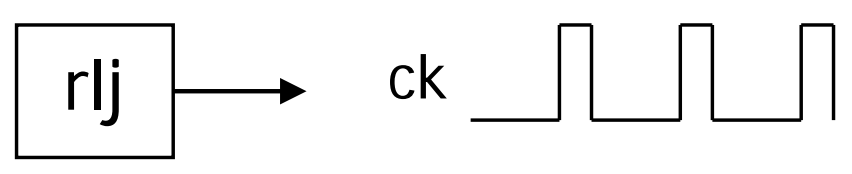   | Circuito que genera una secuencia periódica e indefinida de pulsos (`ck`) de período _T_ y frecuencia _F=1/T_. |
| Contador binario de 4 bits                     | 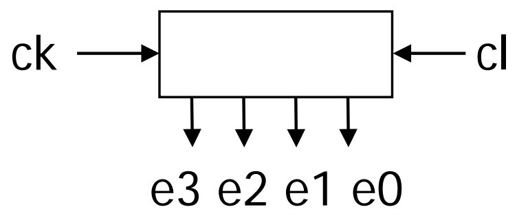 | `cl=1`: pone a 0 los 4 bits almacenados (`e3:e0`), y al llegar un pulso `ck` incrementa a 1 su valor: se genera la secuencia `0000`, `0001`, `0010`... a cada pulso. |

###### Elementos básicos de `CODE-2`

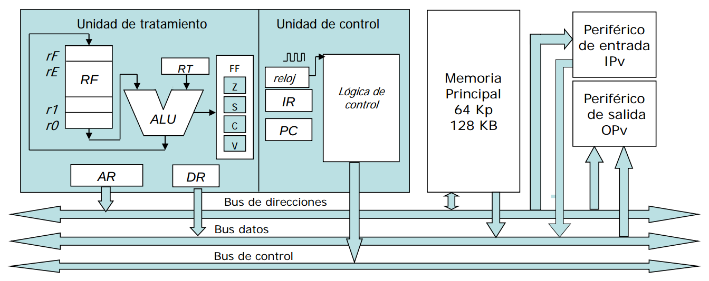

> **Registros de uso temporal** (`R0`...`Rm`) son un alamacenamiento temporal de los datos con los que va a operar la ALU o de resultados intermedios. También se pueden almacenar direcciones de memoria.
>
> * Al registro `R0` se le suele llamar **acumulador** cuando se dedica a almacenar resultados de operaciones entre registros o con una posición de memoria.
> * El registro `RT` es un registro en el que se almacena **uno de los operandos de la ALU**.

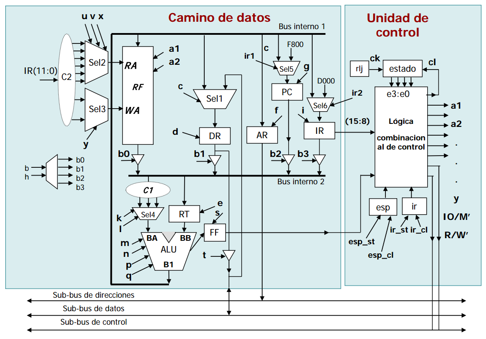

> Esquema completo a nivel micromáquina. Las señales en minúsculas y con flecha representan las **señales de control** o **microórdenes**.

La unidad de tratamiento se comunica internamente a través de dos buses:

* **Bus 1:** conecta la salida de la ALU (`B1`) con las entradas del banco de 16 registros (`RF`), las entradas de los registros `DR`, `AR`, `IR`, y la entrada del contador de programa (`PC`). Para llevar la información de la ALU a uno de los registros:
  1. la señal de control del selector debe conectar el bus a la entrada del registro.
  2. dar un pulso en la señal de control de carga del registro.
* **Bus 2:** conecta las salidas de `RF`, `DR`, `AR`, `IR` con las entradas de la ALU.
  * El acceso al bus se controla mediante **señales tri-estado** (`b0`, `b1`, `b2`, `b3`).

###### Ejemplos

###### > _Acceso a bus 1: llevar la salida de la ALU (`B1`) al `PC`._

1. Activar `irl` (`Sel5`).
2. Pulso de carga de `PC` (`g=1`).

###### > _Acceso a bus 2: llevar el contenido de `DR` a `RT`._

1. `b1=1`.
2. Pulso de carga de `RT` (`e=1`).

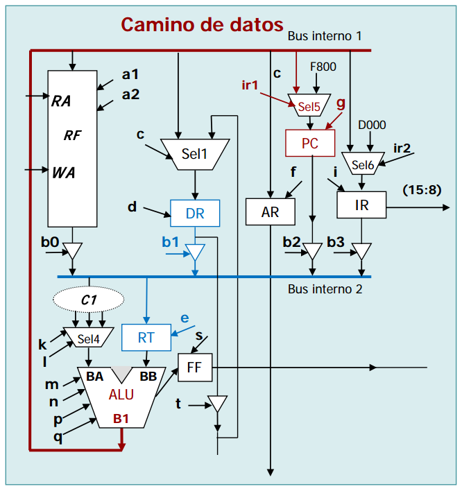

---

* **Módulo `C1`:** interconexiones entre `Bus2` y `Sel4`.

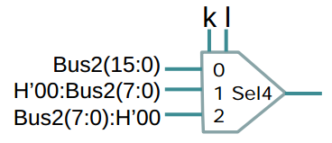

* **Módulo `C2`:** conexiones entre `Sel2` y `Sel3`.

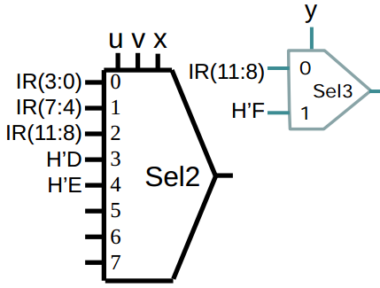

* **`RF`** contiene 16 registros de 16 bits.

  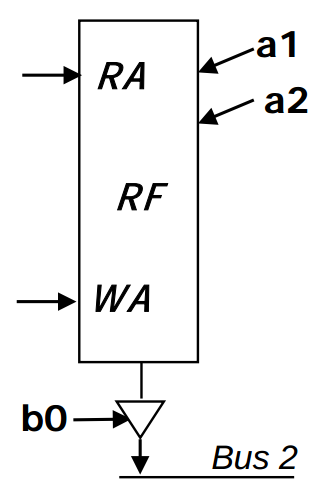

  * `RA` (4 bits) selecciona el registro a leer (`r0`, `r1`, ..., `rE`, `rF`).
  * `WA` (4 bits) selecciona el registro a grabar.
  * Señales de control:
    * `a1=1` --> `WA <- bus1`
    * `a2=1` --> leer registro especificado en `RA`
    * `b0=1` --> `bus2 <- RF`

* **`DR`**:

  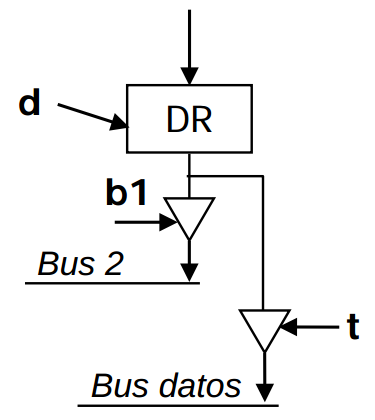

  * `d`: carga paralela de `DR`
  * `b1=1` --> `bus2 <- DR`
  * `t=1` --> `bus datos <- DR`

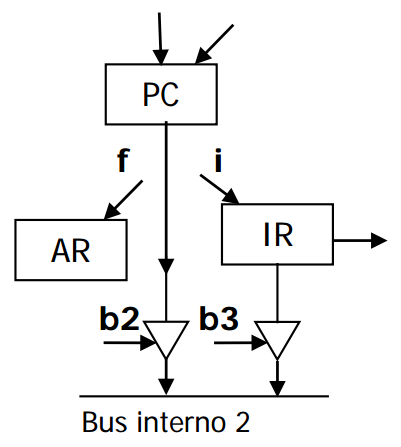

* **`AR`**:
  * `f`: carga en paralelo de `AR`
* **`PC`**:
  * `g`: carga paralela de `PC`
  * `b2=1` --> `bus2 <- PC`
* **`IR`**:
  * `i`: carga paralela de `IR`
  * `b3=1` --> `bus2 <- IR`

* **`FF`**:

  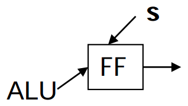

  * `s`: carga de `FF` según resultado de ALU.

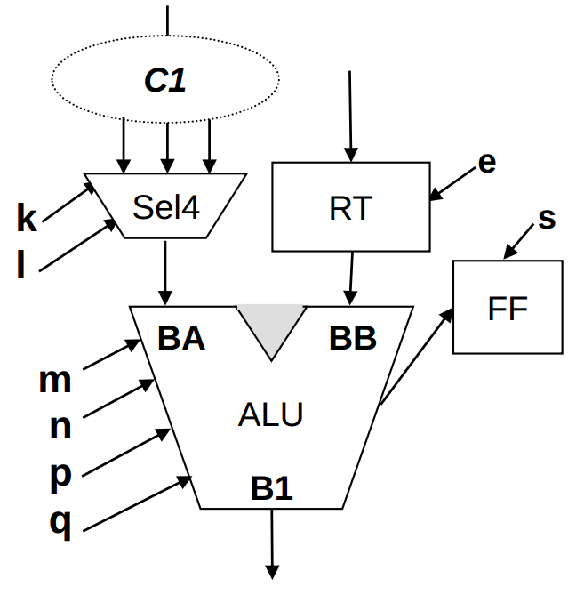

* **`ALU`**: opera con el contenido de `RT` y el dato que llega del `bus1` (a través de `C1` y `Sel4`).

  | Señal de control `mnpq` | Operación en la ALU (`B1`)          |
  | ---------------------------- | ----------------------------------- |
  | `0000`                       | `BA`                                |
  | `0001`                       | `BA+1`                              |
  | `0010`                       | `BA-1`                              |
  | `0011`                       | `BB`                                |
  | `0100`                       | `BB+1`                              |
  | `0101`                       | `BB-1`                              |
  | `0110`                       | Suma de `BA` y `BB` (`C2`)          |
  | `0111`                       | Resta `BA-BB` (`C2`)                |
  | `1000`                       | `NAND`, es decir, `!(BA&&BB)`       |
  | `1001`                       | Desplazamiento a izquierda          |
  | `1010`                       | Desplazamiento a derecha            |
  | `1011`                       | Desplazamiento aritmético a derecha |

* **Funcionamiento de los multiplexores:**

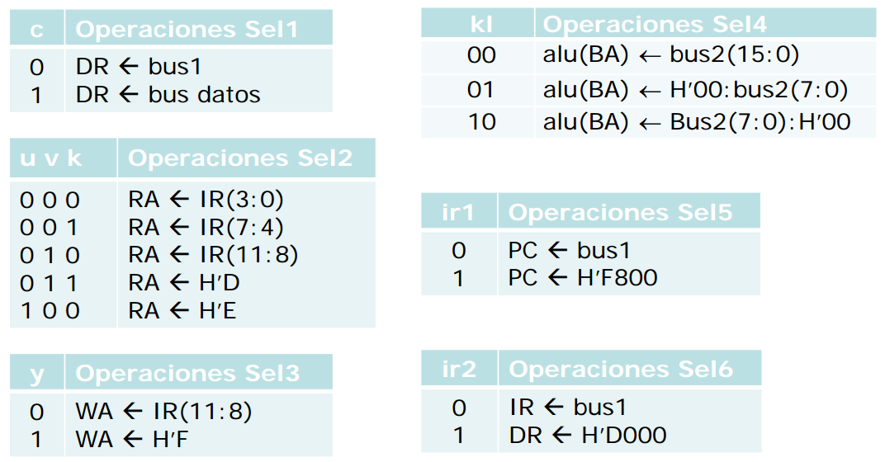

> `H'00` es la dirección de la memoria ROM donde se inicia la rutina de atención de interrupciones y se carga para atender las peticiones de interrupciones.
>
> `H'D000` es la instrucción de llamada a subrutina que se carga en IR para atender una interrupción.

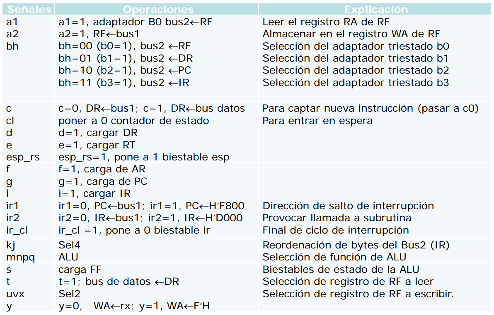

> Todas las señales de control del camino de datos de `CODE-2`

---

#### :pencil: **Ejercicio 1**

**¿Qué señales de control se activan en la fase de captación de instrucción? Es decir:**

~~~
AR <- PC
DR <- M(AR)
IR <- DR
PC <- PC+1
~~~

## 3. Unidad de control cableada

La **unidad de control** analiza o interpreta la instrucción máquina almacenada en `IR` y los valores de los biestables (`FF`, `esp`, `ir`) y genera las 29 señales de control que monitorizan el funcionamiento de los distintos elementos del computador.

Estas señales de control (o **microórdenes**) producen **microoperaciones** en un orden predeterminado de forma sincronizada con un **estado máquina**.

Vamos a ver cómo se diseña la unidad de control de `CODE-2` de forma **cableada**. Ésta ha sido diseñada para ejecutar el siguiente repertorio de instrucciones:

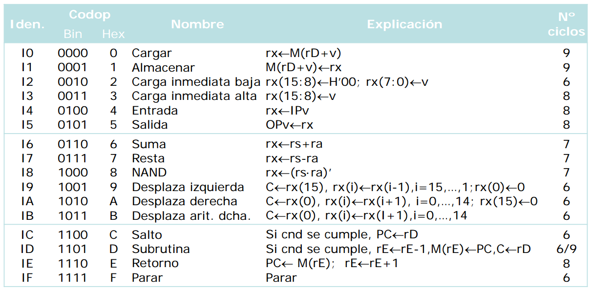

###### Ciclo de unidad de control simplificado

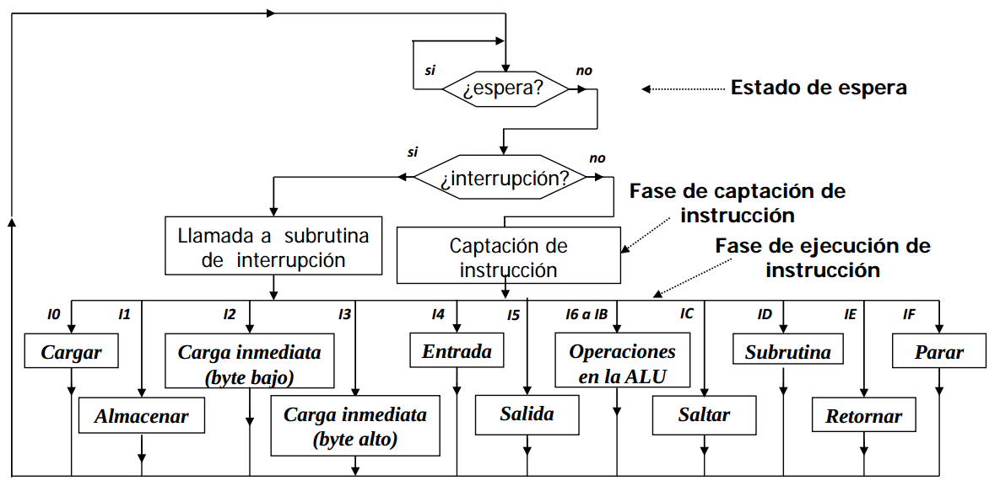

> Antes de ejecutar una instrucción se puede entrar en un ciclo de parada o espera, controlado por un biestable, `esp`. El reloj se para. Al no llegar pulos de reloj todo se para.
>
> * `esp=1` cuando `esp_st=1`
> * `esp=0` cuando `esp_cl=1`
>
> Fase de captación de la instrucción que hay en la dirección de `PC` si no hay una llamada a la rutina de gestión de interrupciones (_interruption request_ = `0`).
>
> Fase de ejecución.

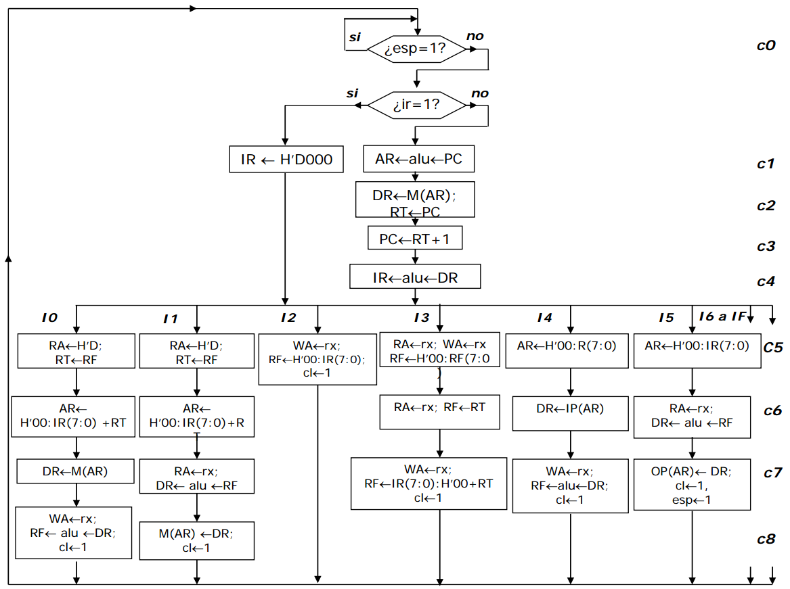

> Esquema más detallado con las microoperaciones que se generan para implementar las distinas instrucciones.
>
> Los ciclos de reloj o **estados máquina** se simbolizan con un `c1`, `c2`, ..., `c9`. Se corresponden con un pulso de reloj.
>
> Después de comprobar si el biestable de espera está a 1 (`esp = 1`) y de si hay una petición de interrupción (`ir = 1`), caso de que no se haya producido ninguna de las dos se pasa a la fase de captación de la instrucción:
>
> 1. llevar el contenido del `PC` al `AR`
> 2. leer de memoria  (`DR <- M(AR)`)
> 3. Incrementar el `PC`
> 4. llevar al `IR` la instrucción
>
> Esto se hace en los ciclos o estados `c1`, `c2`, `c3` y `c4`. 
>
> Para realizar el diagrama de flujo hay que secuenciar bien las microoperaciones e incluir en el mismo estado aquellas que sean compatibles para que se consuma el menor número de ciclos posible.
>
> A continuación se pasa a la ejecución de la instrucción.

###### Ejemplos

* Instrucción `I0` (cargar) `rx <- M(rD+v)`
  * Estado `c5`: `RA <- H’D; RT <- RF`
  * Estado `c6`: `AR <- H’00:IR(7:0) + RT`
  * Estado `c7`: `DR <- M(AR)`
  * Estado `c8`: `WA <- rx; RF <- alu <- DR; cl <- 1`
* Instrucción `I6` (suma) `rx <- rs+ra`
  * Estado `c5`: `RA <- ra; RT <- RF`
  * Estado `c6`: `RA <- rs; WA <- rx; RF <- RF + RT; cl <- 1`

#### :pencil: **Ejercicio 2**

**Describir las microoperaciones necesarias para ejecutar las instrucciones `I1` e `I8`, donde:**

* Instrucción `I1` ()